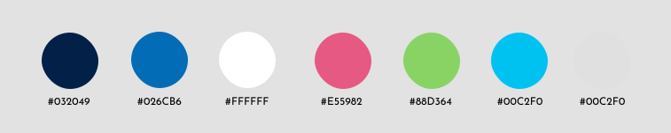
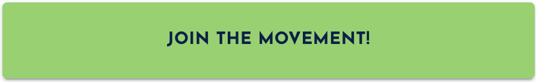
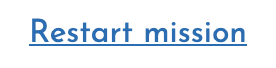
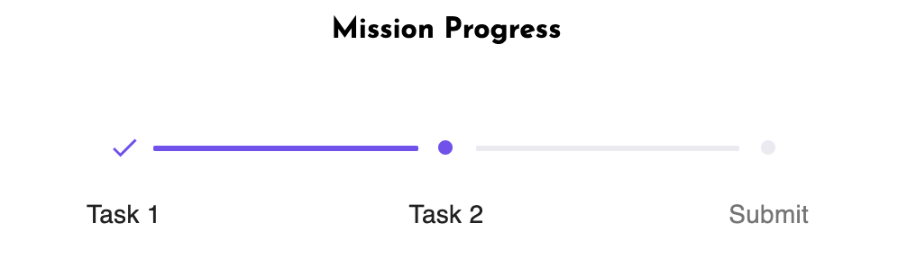
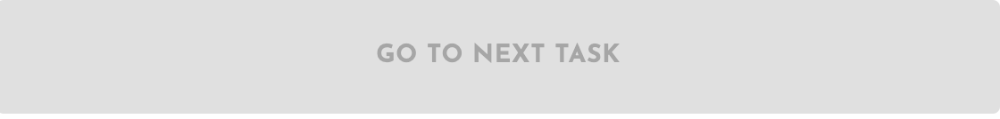

# Style guide

**Contents**

- [Style guide](#style-guide)
  - [Guidelines](#guidelines)
  - [Use of colours](#use-of-colours)
  - [Typography](#typography)
  - [Libraries and frameworks](#libraries-and-frameworks)

## Guidelines

We will adhere to [Teach A Man To Fish brand guidelines](https://drive.google.com/file/d/1bJMeFgV_CgyBV2MHdpshBZx0saO-F4Mf/view):

_Principles:_

- Clear, confident and engaging tone of voice, always in present tone and active voice.
- No acronyms
- Contrast at 70%

_Font:_

- Josefin sans

_Colours:_

- We will stick to brand primary and secondary colours and include a lither blue and light grey.

_Brand logo:_

- Teach a Man to Fish logo to be small and used against a white background

  

_Mobile first:_

- All layouts will be built for mobile first.

## Use of colours

| Colour name     | Hex code  | Colour                              |  Use                                                |
| --------------- | :-------: | ----------------------------------: | --------------------------------------------------: |
| fontColour      | `#032049` |              | Headings, subheadings, paragraphs and buttons text. |
| linkColour      | `#026CB6` |              | Escape route links: go back, restart and help.      |
| bgColour        | `#FFFFFF` |            | App background colour                               |
| accentColour    | `#E55982` |              | Button and link hover, also active states.          |
| primaryColour   | `#88D364` |            | Buttons background                                  |
| secondaryColour | `#00C2F0` |  | Navigation bar                                      |
| inactiveColour | `#E0E0E0` |              | Inactive and disabled states                         |

## Typography

font-family: "Josefin Sans", sans-serif;

| Component  |                 Size and style                 | Example                             |
| ---------- | :--------------------------------------------: | ----------------------------------: |
| Button     |                1 rem uppercase                 |          |
| Heading    |  h1, 2rem capitalised, 4rem for wider screens  |        |
| Subheading | h2, 1.5rem uppercase, 2.2rem for wider screens |  |
| Links      |               a, 1rem underlined               |            |

## Libraries and frameworks

There will be no CSS files in the project. Styled components framework will be used and Material UI library for the components below:

- Navbar

- Stepper

  

- Button enabled and disabled states

